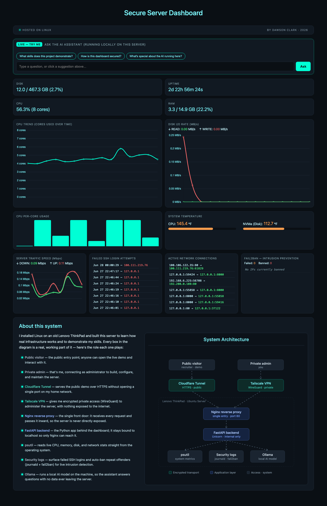

# Homelab Security Dashboard


This project is a real-time server monitoring and security dashboard I built on a repurposed Lenovo ThinkPad. I designed this project to practice Linux administration, network security, backend development, practical AI implementation, and live data visualization.

> **Live Demo:** _coming soon_ &nbsp;·&nbsp; **Private access** secured over a WireGuard VPN



---

## Overview

As a student studying Cybersecurity and Finance at Florida Gulf Coast University, I wanted to spend my summer learning and acquiring real world skills. I wanted to spend time learning how real servers are actually deployed and secured instead of just reading about it. Therefore, I wiped my old ThinkPad and installed Ubuntu Linux. This turned my newly fashioned hardware into an always-on Linux server I could build on.

From there, I hardened the server across three layers: the network, the operating system, and the application itself. I set up fail2ban to detect and block repeated failed SSH login attempts, scoped every permission tightly instead of leaving broad access open, and layered authentication on top of all of it. Once the server itself was locked down, I built this dashboard to sit on top of it — reading live system and security metrics in real time, including the intrusion-detection feed and a small AI assistant that runs locally on the server so no data ever leaves the machine.

I administer the server remotely over a Tailscale (WireGuard) VPN, which leaves no ports open and everything encrypted. The public demo you're looking at is served through a separate Cloudflare Tunnel, allowing me to keep administration private while demonstrating my project. For the frontend, I built a custom HTML, CSS, and JavaScript interface with live Chart.js graphs, while using Claude Code as a coding partner to move faster. Every architecture, design, and security decision was mine.

> As AI continues to evolve, I believe leveraging AI to enhance projects and streamline workflows is becoming a critical and highly sought-after skill.

---

## Features

- **Live system metrics** — CPU, RAM, disk, network throughput, uptime, and hardware temperatures, updated once per second
- **Per-core CPU visualization** and real-time throughput graphs (Chart.js)
- **Intrusion detection feed** — parses the Linux system journal to display failed SSH login attempts as they happen
- **fail2ban integration** — shows currently banned IPs and total blocked attempts
- **Live network connections** — active established connections to the server
- **On-device AI assistant** — a local LLM (Ollama + Llama 3.2 3B) that answers questions about the project; no data ever leaves the server
- **Session-based authentication** with HttpOnly cookies and per-IP rate limiting

---

## Architecture

```
                    ┌─────────────────────────────────────────┐
   Public visitor   │  Lenovo ThinkPad — Ubuntu Server         │
        │           │                                          │
        ▼           │   ┌──────────┐      ┌──────────────────┐ │
  Cloudflare Tunnel ─────►  Nginx   ├──────►  FastAPI/Uvicorn │ │
   (HTTPS, public)  │   │ (port 80)│      │  (port 8000,     │ │
                    │   │ reverse  │      │   internal only) │ │
        │           │   │  proxy   │      └────────┬─────────┘ │
        ▼           │   └──────────┘               │           │
  Private admin     │                    ┌─────────▼─────────┐ │
  over Tailscale ───────────────────────►│ psutil · journald │ │
   (WireGuard VPN)  │                    │ fail2ban · Ollama │ │
                    │                    └───────────────────┘ │
                    └─────────────────────────────────────────┘
```

- **Nginx** acts as a reverse proxy, isolating the application layer from direct exposure and providing a single controlled entry point (enables TLS termination and request filtering).
- The **FastAPI backend** is never exposed directly to the internet — it binds to `127.0.0.1:8000` and is only reachable through Nginx.
- **Remote admin access** runs over Tailscale (a WireGuard-based VPN) with **no public ports open** — real encrypted transport, not a simulation.
- The service is managed by **systemd** and restarts automatically on failure or reboot.

---

## Security Highlights (Defense in Depth)

| Layer | Control |
|-------|---------|
| **Transport** | WireGuard VPN (Tailscale) for private access; Cloudflare Tunnel provides TLS for the public demo — no inbound ports exposed on the host |
| **Application** | Session-based auth with HttpOnly cookies; rate limiting on the AI endpoint (6 req/min/IP) and demo sessions (20/hr/IP) |
| **Operating system** | fail2ban bans IPs after repeated failed SSH attempts; sudo privileges scoped to specific commands via `sudoers.d` |
| **Data** | The AI model runs entirely on-device (Ollama) — no user input or system data is sent to any third party |

---

## Tech Stack

| Layer | Tools |
|-------|-------|
| **Backend** | Python, FastAPI, Uvicorn, psutil |
| **Frontend** | Vanilla HTML/CSS/JavaScript, Chart.js |
| **Infrastructure** | Ubuntu Server, Nginx (reverse proxy), systemd |
| **Networking / Security** | Tailscale (WireGuard), Cloudflare Tunnel, fail2ban |
| **AI** | Ollama running Llama 3.2 3B, locally hosted |

---

## What This Project Demonstrates

- Installing Linux from a USB flash drive and administering a server from a bare-metal OS install, with no cloud provider or pre-built image
- Setting up a WireGuard-based VPN (Tailscale) for encrypted, zero-open-port remote administration
- Designing a network architecture that separates private administrative access from public-facing access, routing the public demo through a completely different path (Cloudflare Tunnel) than the one used to manage the server
- Applying layered security controls across the network, OS, and application layers, including intrusion detection and prevention (fail2ban) and a reverse proxy (Nginx) that keeps the backend from ever facing the internet directly
- Building a backend API that interfaces directly with the operating system
- Self-hosting an AI model with zero cloud dependency
- End-to-end system design and creative problem-solving

---

## Skills

| Category | Skills |
|----------|--------|
| **Cybersecurity & Network Security** | Intrusion detection & prevention (fail2ban) · VPN/encrypted networking (Tailscale, WireGuard) · Network segmentation & access separation · Authentication & access control · Rate limiting |
| **Cloud & Infrastructure Architecture** | Reverse proxy design (Nginx) · Zero-trust-style admin/public separation · Service supervision & auto-recovery (systemd) · Secure tunneling (Cloudflare Tunnel) |
| **Linux & Systems Administration** | Bare-metal OS installation (USB flash drive) · Ubuntu Server administration · Process/service management · Least-privilege permission scoping (sudoers) |
| **Backend Development** | Python · FastAPI · REST API design · OS-level system interfacing (psutil, journald) |
| **Frontend & Data Visualization** | HTML/CSS/JavaScript · Chart.js · Real-time data polling · Live dashboard design |
| **Applied AI** | Self-hosted/local LLM deployment (Ollama, Llama 3.2) · AI-assisted development workflow (Claude Code) |

---

_Built by Dawson Clark, July 2026._
